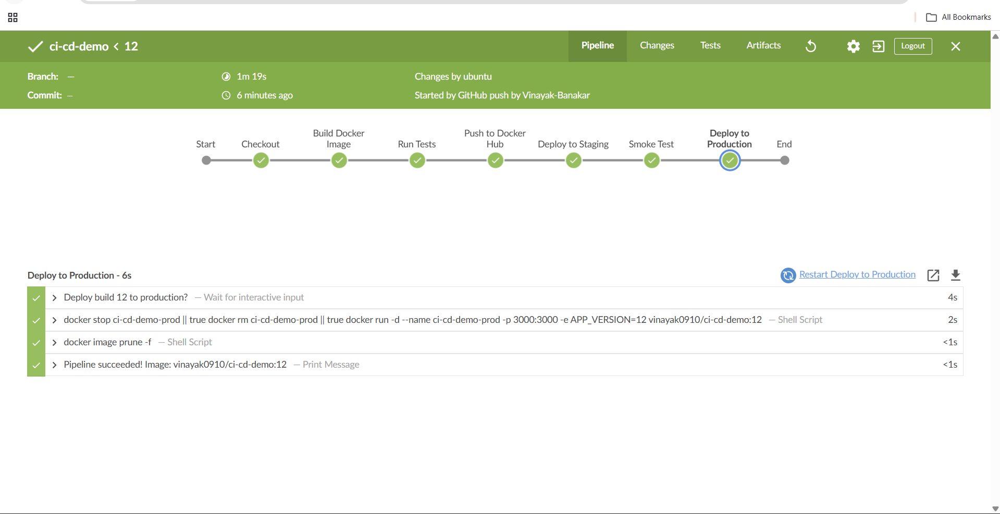
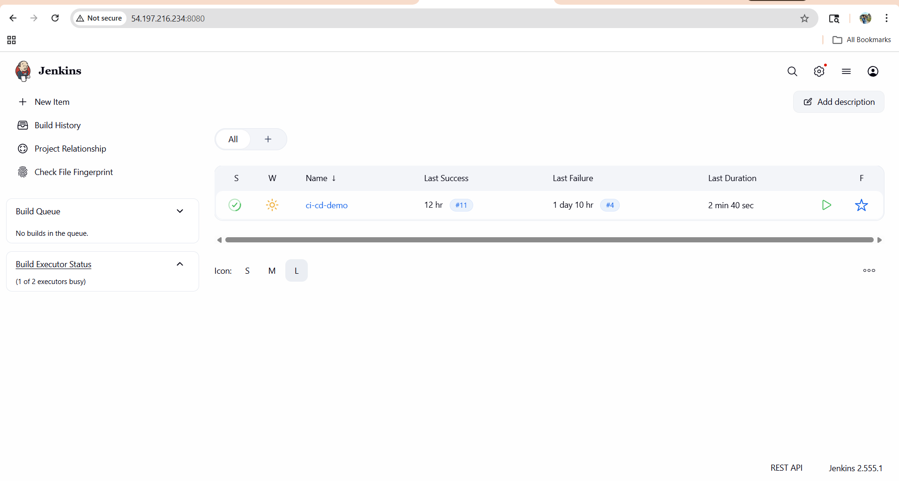
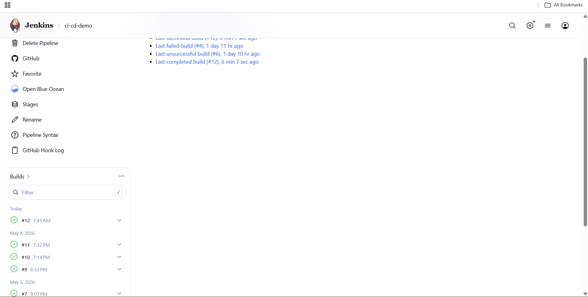
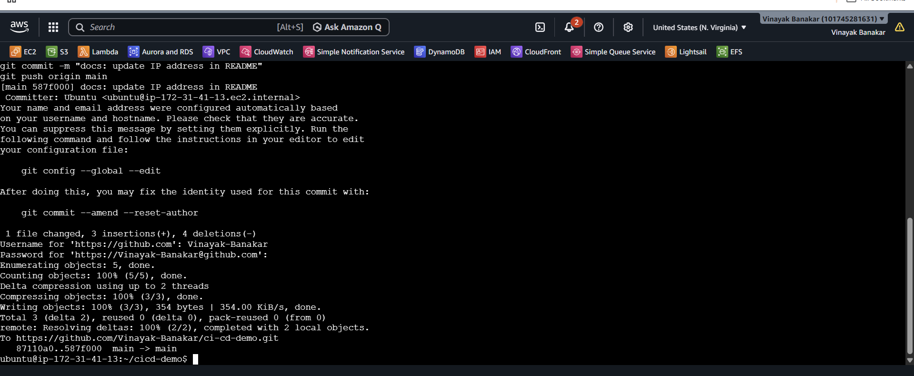
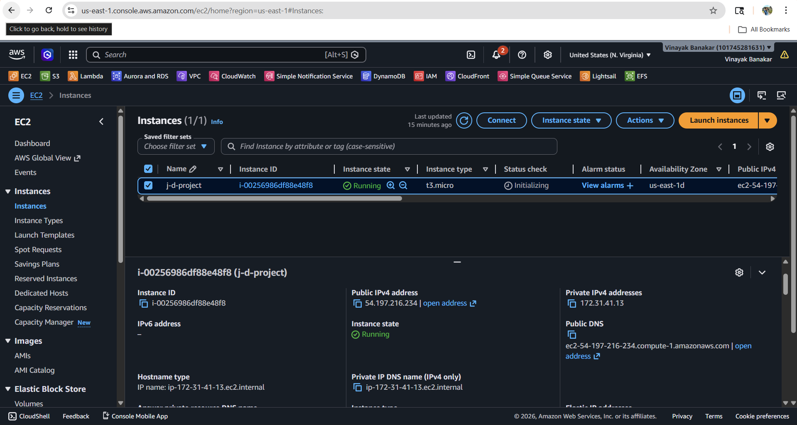
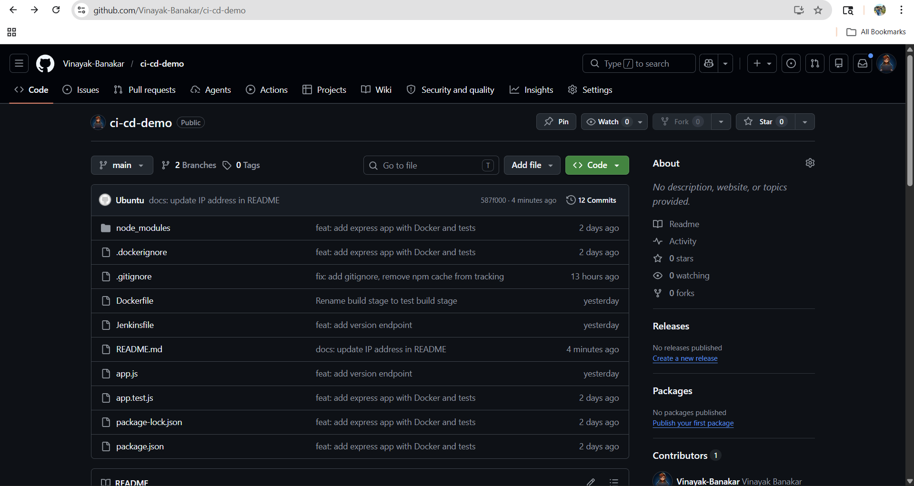
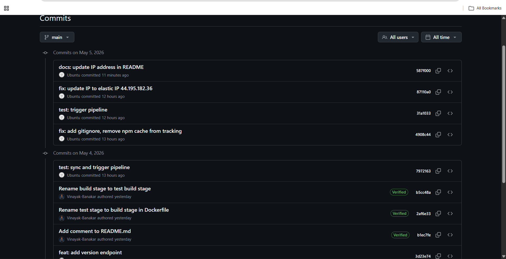

# CI/CD Demo — Docker + Jenkins Pipeline

A production-grade CI/CD pipeline built with Jenkins and Docker, deployed on AWS EC2. Every `git push` automatically builds, tests, and deploys the application.

---

## Pipeline Overview



---

## Architecture
git push → GitHub Webhook → Jenkins Pipeline
↓
docker build (multi-stage)
↓
npm test (Jest inside Docker)
↓
docker push → Docker Hub
↓
Deploy to Staging → Smoke Test
↓
Deploy to Production (manual approval)

---

## Jenkins Build History





---

## Pipeline Stages

| Stage | Description |
|---|---|
| Checkout | Pulls latest code from GitHub |
| Build Docker Image | Multi-stage build, tests run inside Docker |
| Run Tests | Jest + Supertest tests run inside container |
| Push to Docker Hub | Versioned image pushed as build number and latest |
| Deploy to Staging | Container deployed on port 3001 |
| Smoke Test | Hits /health endpoint to verify deployment |
| Deploy to Production | Deploys on port 3000 with manual approval |

---

## Tech Stack

- **App** — Node.js + Express
- **Testing** — Jest + Supertest
- **Containerization** — Docker (multi-stage builds)
- **CI/CD** — Jenkins (declarative pipeline)
- **Registry** — Docker Hub
- **Cloud** — AWS EC2
- **Trigger** — GitHub Webhooks (auto trigger on every push)

---

## AWS Infrastructure





---

## Live Endpoints

.png)

.png)

| Environment | URL |
|---|---|
| Production | `http://54.197.216.234:3000/health` |
| Staging | `http://54.197.216.234:3001/health` |

---

## GitHub Repository





---

## Docker Hub

Image available at: `vinayak0910/ci-cd-demo`

```bash
docker pull vinayak0910/ci-cd-demo:latest
docker run -p 3000:3000 vinayak0910/ci-cd-demo:latest
```

---

## Run Locally

```bash
# Clone the repo
git clone https://github.com/Vinayak-Banakar/ci-cd-demo.git
cd ci-cd-demo

# Run with Docker
docker pull vinayak0910/ci-cd-demo:latest
docker run -p 3000:3000 vinayak0910/ci-cd-demo:latest

# Test endpoints
curl http://localhost:3000/
curl http://localhost:3000/health
curl http://localhost:3000/version
```

---

## Jenkins Pipeline

Every `git push` to `main` automatically:

- Builds a new Docker image
- Runs all tests inside Docker
- Pushes versioned image to Docker Hub
- Deploys to staging with smoke test
- Deploys to production with manual approval gate

---

## Key Features

- Automated pipeline triggers on every `git push` via GitHub webhook
- Multi-stage Docker build separates test and production environments
- Tests run inside Docker — same environment as production
- Every build creates a versioned Docker image for full traceability
- Staging deployment with automated smoke test before production
- Production deployment requires manual approval gate
- Automatic cleanup of unused Docker images after every build
